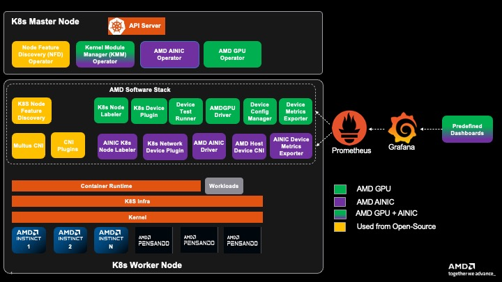

# Installation of GPU Operator and Network Operator together

AMD GPU Operator and AMD Network Operator could co-exist in the same Kubernetes cluster, here are the instructions to do the installation and uninstallation for the use case where 2 operators are working together.

## K8s Cluster with AMD Network and AMD GPU Operators



## Installation

### 1. Install Cert-Manager

If cert-manager is already installed in your cluster, you can skip this step.

The Kubernetes `cert-manager` is a pre-requisite required by both AMD GPU and Network Operator to do the TLS certificate management.

- Add the cert-manager repository:

```bash
helm repo add jetstack https://charts.jetstack.io --force-update
```

- Install cert-manager:

```bash
helm install cert-manager jetstack/cert-manager \
  --namespace cert-manager \
  --create-namespace \
  --version v1.15.1 \
  --set crds.enabled=true
```

- Verify the installation:

```bash
kubectl get pods -n cert-manager
```

Expected output:

```bash
NAME                                       READY   STATUS    RESTARTS   AGE
cert-manager-84489bc478-qjwmw             1/1     Running   0          2m
cert-manager-cainjector-7477d56b47-v8nq8  1/1     Running   0          2m
cert-manager-webhook-6d5cb854fc-h6vbk     1/1     Running   0          2m
```

### 2. Install AMD GPU Operator

If AMD GPU Operator is already installed in your cluster, you can skip this step.

Please refer to [AMD GPU Operator official documentation](https://instinct.docs.amd.com/projects/gpu-operator/en/latest/installation/kubernetes-helm.html#installing-operator) for detailed installation and configuration instructions. Here are the quick start instructions:

2.1 Add ROCm helm chart repository

```bash
# Add AMD GPU Operator helm repository
helm repo add rocm https://rocm.github.io/gpu-operator
helm repo update
```

2.2 Install AMD GPU Operator helm chart

The default command to install the chart is:

```bash
helm install amd-gpu-operator rocm/gpu-operator-charts \
      --namespace kube-amd-gpu --create-namespace \
      --version=v1.4.0
```

Different users may have various deployment scenarios, please consider configuring these helm options when installing the helm chart:

- If you are using a VM based worker node:
  - case 1: Using AMD GPU in a Virtual Machine with VF-Passthrough, please set `amd-vgpu` in the selector:

    ```bash
    helm install amd-gpu-operator rocm/gpu-operator-charts \
          --namespace kube-amd-gpu --create-namespace \
          --version=v1.4.0 \
          --set-json 'deviceConfig.spec.selector={"feature.node.kubernetes.io/amd-gpu":null,"feature.node.kubernetes.io/amd-vgpu":"true"}'
    ```

  - case 2: Using AMD GPU in a Virtual Machine with PF-Passthrough, please set `amd-gpu` in the selector:

    ```bash
    helm install amd-gpu-operator rocm/gpu-operator-charts \
          --namespace kube-amd-gpu --create-namespace \
          --version=v1.4.0 \
          --set-json 'deviceConfig.spec.selector={"feature.node.kubernetes.io/amd-gpu":"true"}'
    ```

- If your worker node doesn't have inbox / pre-installed amdgpu kernel module loaded:
  Use GPU Operator to install specific version of out-of-tree `amdgpu-dkms` kernel module.

  If you want to use AMD GPU Operator to install kernel module, you need to prepare an image registry and create corresponding secret to access your image registry if needed:

  - case 1: For the secure registry which requires credential:

    ```bash
    # 1. prepare image registry to store driver image (e.g. dockerHub)
    # 2. setup image registry secret:
    # kubectl create secret docker-registry mySecret -n kube-amd-gpu --docker-username=xxx --docker-password=xxx --docker-server=https://index.docker.io/v1/
    helm install amd-gpu-operator rocm/gpu-operator-charts \
          --namespace kube-amd-gpu --create-namespace \
          --version=v1.4.0 \
          --set deviceConfig.spec.driver.enable=true \
          --set deviceConfig.spec.driver.blacklist=true \
          --set deviceConfig.spec.driver.version=7.0.1 \
          --set deviceConfig.spec.driver.image=docker.io/myUserName/amd-driver-image \
          --set deviceConfig.spec.driver.imageRegistrySecret.name=mySecret
    ```

  - case 2: For the insecure image registry:

    ```bash
    # prepare insecure image registry to store driver image
    helm install amd-gpu-operator rocm/gpu-operator-charts \
          --namespace kube-amd-gpu --create-namespace \
          --version=v1.4.0 \
          --set deviceConfig.spec.driver.enable=true \
          --set deviceConfig.spec.driver.blacklist=true \
          --set deviceConfig.spec.driver.version=7.0.1 \
          --set deviceConfig.spec.driver.image=docker.io/myUserName/amd-driver-image \
          --set deviceConfig.spec.driver.imageRegistryTLS.insecure=true \
          --set deviceConfig.spec.driver.imageRegistryTLS.insecureSkipTLSVerify=true
    ```

    then the driver builder pod will be triggered to build the amdgpu driver for your worker node

    ```bash
    kube-amd-gpu   default-build-lsnkw                                               1/1     Running    0          3s
    ```

2.3 Verify AMD GPU Operator installation

After installing AMD GPU Operator you should be able to see the operands (device plugin, metrics exporter, etc) are running and the AMD GPU resources are being advertised

```bash
kube-amd-gpu   default-device-plugin-h7rhq                                       1/1     Running   0          25s
kube-amd-gpu   default-metrics-exporter-qhx8s                                    1/1     Running   0          25s
kube-amd-gpu   default-node-labeller-zx4ww                                       1/1     Running   0          10m
```

```bash
$ kubectl get node -oyaml | grep amd.com/gpu
amd.com/gpu: "8"
amd.com/gpu: "8"
```

By default the AMD GPU Operator would install Node Feature Discovery (NFD) operator and Kernel Module Management (KMM), please make sure those 2 operators are up and running (either pre-installed or installed by AMD GPU Operator helm charts) after this step.

```bash
kube-amd-gpu   amd-gpu-operator-kmm-controller-d9d8d48bc-r86j7                   1/1     Running   0          10m
kube-amd-gpu   amd-gpu-operator-kmm-webhook-server-5c85557488-d8jbj              1/1     Running   0          10m
kube-amd-gpu   amd-gpu-operator-node-feature-discovery-gc-b8547dfb7-jw2x9        1/1     Running   0          10m
kube-amd-gpu   amd-gpu-operator-node-feature-discovery-master-6f587cd597-csbqv   1/1     Running   0          10m
kube-amd-gpu   amd-gpu-operator-node-feature-discovery-worker-6c66c              1/1     Running   0          10m
```

### 3. Install AMD Network Operator

3.1 Install without duplicating NFD and KMM

After installing AMD GPU Operator you can start to install AMD Network Operator. Remember that we already installed `NFD` and `KMM` during installation of AMD GPU Operator, so you shouldn't install them again when installing AMD Network Operator. Please disable the deployment of those 2 dependent operators when installing AMD Network Operator.

3.1.1 Add ROCm helm chart repository

```bash
# Add AMD Network Operator helm repository
helm repo add rocm-network https://rocm.github.io/network-operator
helm repo update
```

3.1.2 Install AMD Network Operator helm chart

```bash
helm install amd-network-operator rocm-network/network-operator-charts \
  -n kube-amd-network \
  --create-namespace \
  --set kmm.enabled=false \
  --set node-feature-discovery.enabled=false \
  --version=v1.1.0
```

Then during this step only the network operator and multus CNI pods would be brought up in the new namespace `kube-amd-network`:

```bash
kube-amd-network   amd-network-operator-multus-multus-h5jvp                          1/1     Running   0          17s
kube-amd-network   amd-network-operator-network-operator-charts-controller-ma2s7cs   1/1     Running   0          17s
```

3.2 (Optional) Install the IONIC kernel module

If your worker nodes don't have inbox / pre-installed ionic kernel module and you want to re-use the existing KMM deployment to install ionic kernel module for AI NIC, you can follow the [drivers installation section](../drivers/drivers.md) to install ionic kernel module for your worker nodes.

> **Note**
>
>You can keep all the Network Operator related image registry secrets in the `kube-amd-network` namespace. The KMM operator is able to manage the AMD Network Operator's kernel module in `kube-amd-network` namespace even though the KMM itself is deployed in another namespace.

If you configured the image registry correctly the KMM builder pod would be triggered to build IONIC kernel module for your worker nodes:

```bash
kube-amd-network   test-networkconfig-build-8xktx                                    1/1     Running    0          9s
```

After the successful kernel module loading the device plugin would be up and running:

```bash
kube-amd-network   test-networkconfig-device-plugin-4ghf4                            1/1     Running   0          4m57s
```

3.3 Verify AMD Network Operator installation

After bringing up all the expected operands, the NIC resources should be advertised in the cluster:

```bash
# for example, for a VM-based worker node
$ kubectl get node -oyaml | grep amd.com/vnic
      amd.com/vnic: "8"
```

You can also trigger some workload to verify your cluster to make sure they are ready to use.

## Uninstallation

Please make sure to uninstall the AMD Network Operator helm chart first, then uninstall the AMD GPU Operator helm chart.

```bash
# Uninstall AMD Network Operator
helm delete amd-network-operator -n kube-amd-network --debug
# Uninstall AMD GPU Operator
helm delete amd-gpu-operator -n kube-amd-gpu --debug
```
