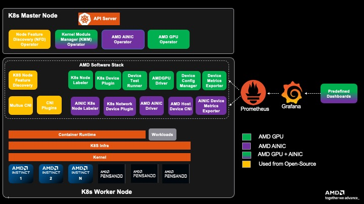

# Kubernetes (Helm)

This guide walks through installing the AMD Network Operator on a Kubernetes cluster using Helm.

## Prerequisites

### System Requirements

- Kubernetes cluster v1.29.0 or later
- Helm v3.2.0 or later
- `kubectl` command-line tool configured with access to the cluster
- Cluster admin privileges

### Cluster Requirements

- A functioning Kubernetes cluster with:
  - All system pods running and ready
  - Properly configured Container Network Interface (CNI)
  - Worker nodes with AMD NICs

### Required Access

- Access to pull images from:
  - AMD's container registry or your configured registry
  - Public container registries (Docker Hub, Quay.io)

## Pre-Installation Steps

### 1. Verify Cluster Status

Check that your cluster is healthy and running:

```bash
kubectl get nodes
kubectl get pods -A
```

Expected output should show:

- All nodes in `Ready` state
- System pods running (kube-system namespace)
- CNI pods running (e.g., Flannel, Calico)

Example of a healthy cluster:

```bash
NAMESPACE      NAME                                          READY   STATUS    RESTARTS   AGE
kube-flannel   kube-flannel-ds-7krtk                         1/1     Running   0          10d
kube-system    coredns-7db6d8ff4d-644fp                      1/1     Running   0          2d20h
kube-system    kube-apiserver-control-plane                  1/1     Running   0          64d
kube-system    kube-controller-manager-control-plane         1/1     Running   0          64d
kube-system    kube-scheduler-control-plane                  1/1     Running   0          64d
```

### 2. Install Cert-Manager

```{note}
If `cert-manager` is already installed in your cluster, you can skip this step.
```

The AMD Network Operator requires `cert-manager` for TLS certificate management.

- Add the `cert-manager` repository:

```bash
helm repo add jetstack https://charts.jetstack.io --force-update
```

- Install `cert-manager`:

```bash
helm install cert-manager jetstack/cert-manager \
  --namespace cert-manager \
  --create-namespace \
  --version v1.15.1 \
  --set crds.enabled=true
```

- Verify the installation:

```bash
kubectl get pods -n cert-manager
```

Expected output:

```bash
NAME                                       READY   STATUS    RESTARTS   AGE
cert-manager-84489bc478-qjwmw             1/1     Running   0          2m
cert-manager-cainjector-7477d56b47-v8nq8  1/1     Running   0          2m
cert-manager-webhook-6d5cb854fc-h6vbk     1/1     Running   0          2m
```

3. ## Installing Network Operator

> **Warning**
>
> If you are trying to install AMD GPU Operator and AMD Network Operator together within the same Kubernetes cluster, please jump to this section [Installation of GPU Operator and Network Operator together](#installation-of-gpu-operator-and-network-operator-together)

### 1. Add the AMD Helm Repository

```bash
helm repo add rocm https://rocm.github.io/network-operator
helm repo update
```

### 2. Install the Operator

Basic installation:

```bash
helm install amd-network-operator rocm/network-operator-charts \
  --namespace kube-amd-network \
  --create-namespace \
  --version=v1.0.0
```

```{note}
Installation Options
  - Skip NFD installation: `--set node-feature-discovery.enabled=false`
  - Skip Multus installation: `--set multus.enabled=false`
  - Disable default NFD rules: `--installdefaultNFDRule=false`  
```

### 3. Helm Chart Customization Parameters

Installation with custom options:

- Prepare your custom configuration in a YAML file (e.g. ```values.yaml```), then use it with ```helm install``` command to deploy your helm charts.

```bash
helm install amd-network-operator rocm/network-operator-charts \
  --namespace kube-amd-network \
  --create-namespace \
  -f values.yaml
```

The following parameters are able to be configured when using the Helm Chart. In order to view all available options, please refer to this section or run the command:
```bash
helm show values rocm/network-operator-charts
```

| Key | Type | Default | Description |
|-----|------|---------|-------------|
| controllerManager.manager.image.repository | string | `"docker.io/rocm/network-operator"` | AMD Network operator controller manager image repository |
| controllerManager.manager.image.tag | string | `"v1.0.0"` | AMD Network operator controller manager image tag |
| controllerManager.manager.imagePullPolicy | string | `"Always"` | Image pull policy for AMD GNetworkPU operator controller manager pod |
| controllerManager.manager.imagePullSecrets | string | `""` | Image pull secret name for pulling AMD Network operator controller manager image if registry needs credential to pull image |
| controllerManager.manager.resources.limits.cpu | string | `"1000m"` | CPU limits for the controller manager. Consider increasing for large clusters |
| controllerManager.manager.resources.limits.memory | string | `"1Gi"` | Memory limits for the controller manager. Consider increasing if experiencing OOM issues |
| controllerManager.manager.resources.requests.cpu | string | `"100m"` | CPU requests for the controller manager. Adjust based on observed CPU usage |
| controllerManager.manager.resources.requests.memory | string | `"256Mi"` | Memory requests for the controller manager. Adjust based on observed memory usage |
| controllerManager.nodeAffinity.nodeSelectorTerms | list | `[{"key":"node-role.kubernetes.io/control-plane","operator":"Exists"},{"key":"node-role.kubernetes.io/master","operator":"Exists"}]` | Node affinity selector terms config for the AMD Network operator controller manager, set it to [] if you want to make affinity config empty |
| controllerManager.nodeSelector | object | `{}` | Node selector for AMD Network operator controller manager deployment |
| installdefaultNFDRule | bool | `true` | Set to true to install default NFD rule for detecting AMD NIC hardware based on pci vendor ID and device ID |
| kmm.controller.manager.env.relatedImageBuild | string | `"gcr.io/kaniko-project/executor:v1.23.2"` | KMM kaniko builder image for building driver image within cluster |
| kmm.controller.manager.env.relatedImageBuildPullSecret | string | `""` | Image pull secret name for pulling KMM kaniko builder image if registry needs credential to pull image |
| kmm.controller.manager.env.relatedImageSign | string | `"docker.io/rocm/kernel-module-management-signimage:v1.4.0"` | KMM signer image for signing driver image's kernel module with given key pairs within cluster |
| kmm.controller.manager.env.relatedImageSignPullSecret | string | `""` | Image pull secret name for pulling KMM signer image if registry needs credential to pull image |
| kmm.controller.manager.env.relatedImageWorker | string | `"docker.io/rocm/kernel-module-management-worker:v1.4.0"` | KMM worker image for loading / unloading driver kernel module on worker nodes |
| kmm.controller.manager.env.relatedImageWorkerPullSecret | string | `""` | Image pull secret name for pulling KMM worker image if registry needs credential to pull image |
| kmm.controller.manager.image.repository | string | `"docker.io/rocm/kernel-module-management-operator"` | KMM controller manager image repository |
| kmm.controller.manager.image.tag | string | `"v1.4.0"` | KMM controller manager image tag |
| kmm.controller.manager.imagePullPolicy | string | `"Always"` | Image pull policy for KMM controller manager pod |
| kmm.controller.manager.imagePullSecrets | string | `""` | Image pull secret name for pulling KMM controller manager image if registry needs credential to pull image |
| kmm.controller.nodeAffinity.nodeSelectorTerms | list | `[{"key":"node-role.kubernetes.io/control-plane","operator":"Exists"},{"key":"node-role.kubernetes.io/master","operator":"Exists"}]` | Node affinity selector terms config for the KMM controller manager deployment, set it to [] if you want to make affinity config empty |
| kmm.controller.nodeSelector | object | `{}` | Node selector for the KMM controller manager deployment |
| kmm.enabled | bool | `true` | Set to true/false to enable/disable the installation of kernel module management (KMM) operator |
| kmm.webhookServer.nodeAffinity.nodeSelectorTerms | list | `[{"key":"node-role.kubernetes.io/control-plane","operator":"Exists"},{"key":"node-role.kubernetes.io/master","operator":"Exists"}]` | Node affinity selector terms config for the KMM webhook deployment, set it to [] if you want to make affinity config empty |
| kmm.webhookServer.nodeSelector | object | `{}` | KMM webhook's deployment node selector |
| kmm.webhookServer.webhookServer.image.repository | string | `"docker.io/rocm/kernel-module-management-webhook-server"` | KMM webhook image repository |
| kmm.webhookServer.webhookServer.image.tag | string | `"dev"` | KMM webhook image tag |
| kmm.webhookServer.webhookServer.imagePullPolicy | string | `"Always"` | Image pull policy for KMM webhook pod |
| kmm.webhookServer.webhookServer.imagePullSecrets | string | `""` | Image pull secret name for pulling KMM webhook image if registry needs credential to pull image |
| upgradeCRD | bool | `true` | CRD will be patched as pre-upgrade/pre-rollback hook when doing helm upgrade/rollback to current helm chart |
| node-feature-discovery.enabled | bool | `true` | Set to true/false to enable/disable the installation of node feature discovery (NFD) operator |
| multus.enabled | bool | `true` | Set to true/false to enable/disable the installation of multus |
| multus.config | map | `{}` | CNI configuration to be passed to the multus configmap. If not set, multus will auto-generate a default configuration |

### 3. Verify the Operator Installation

Check that all operator components are running:

```bash
kubectl get pods -n kube-amd-network
```

Expected output:

```bash
NAME                                                              READY   STATUS    RESTARTS   AGE
amd-network-operator-multus-multus-qjlvq                          1/1     Running   0
amd-network-operator-network-operator-charts-controller-man9bgt   1/1     Running   0          9h
amd-network-operator-node-feature-discovery-gc-77d6d6449c-46868   1/1     Running   0          9h
amd-network-operator-node-feature-discovery-master-869f4bbwjp75   1/1     Running   0          9h
amd-network-operator-node-feature-discovery-worker-vzwf9          1/1     Running   0          9h
```

Verify that nodes with AMD NIC hardware are properly labeled:

```bash
kubectl get nodes -L feature.node.kubernetes.io/amd-nic
```

## Resource Configuration

### Controller Manager Resource Settings

The AMD Network Operator controller manager component has default resource limits and requests configured for typical usage scenarios. You may need to adjust these values based on your specific cluster environment:

```yaml
controllerManager:
  manager:
    resources:
      limits:
        cpu: 1000m
        memory: 1Gi
      requests:
        cpu: 100m
        memory: 256Mi
```

#### When to Adjust Resource Settings

You should consider adjusting the controller manager resource settings in these scenarios:

- **Large clusters**: If managing a large number of nodes or NIC devices, consider increasing both CPU and memory limits
- **Memory pressure**: If you observe OOM (Out of Memory) kills in controller manager pods, increase the memory limit and request
- **CPU pressure**: If the controller manager is experiencing throttling or slow response times during operations, increase the CPU limit and request
- **Resource-constrained environments**: For smaller development or test clusters, you may reduce these values to conserve resources

You can apply resource changes by updating your values.yaml file and upgrading the Helm release:

```bash
helm upgrade amd-network-operator rocm/network-operator-charts \
  --debug \
  --namespace kube-amd-network \
  --version=v1.0.0
  -f values.yaml
```

## Install Custom Resource

After the installation of AMD Network Operator:
  * For the network operator to begin working and orchestrate its operands, a `NetworkConfig` custom resource must be created. This can be accomplished by preparing a YAML manifest and applying it by running ```kubectl apply -f networkconfig.yaml```.
  * For custom resource definition and more detailed information, please refer to [Custom Resource Installation Guide](./networkconfig.md). Here are some examples for common deployment scenarios.


## Post-Installation Verification

Verify driver installation status:

```bash
kubectl get networkconfigs -n kube-amd-network -oyaml
```

Verify the AMD NIC allocatable resource:

```bash
kubectl get nodes -oyaml | grep "amd.com/nic"
kubectl get nodes -oyaml | grep "amd.com/vnic"
```

Verify the AMD NIC node label:

```bash
kubectl get nodes -oyaml | grep  "amd.com"
```

## Test a Workload Deployment

To deploy the workload with an AMD NIC, please refer to [workload](workload.md) for the detailed instructions.

## Troubleshooting

If you encounter issues during installation:

- Check operator logs:

```bash
kubectl logs -n kube-amd-network deployment \
    amd-network-operator-network-operator-charts-controller-manager
```

- Check NFD status:

```bash
kubectl get nodefeaturerules -n kube-amd-network
```

- Check Multus status:

```bash
kubectl get network-attachment-definition -n kube-amd-network
```

For more detailed troubleshooting steps, see our [Troubleshooting Guide](../troubleshooting.md).

## Uninstallation

Please refer to the [Uninstallation](../uninstallation/uninstallation.md) document for uninstalling related resources.

# Installation of GPU Operator and Network Operator together

AMD GPU Operator and AMD Network Operator could co-exist in the same Kubernetes cluster, here are the instructions to do the installation and uninstallation for the use case where 2 operators are working together.

### K8s Cluster with AMD Network and AMD GPU Operators



## Installation 

### 1. Install Cert-Manager

If cert-manager is already installed in your cluster, you can skip this step.

The Kubernetes `cert-manager` is a pre-requisite required by both AMD GPU and Network Operator to do the TLS certificate management.

* Add the cert-manager repository:

```bash
helm repo add jetstack https://charts.jetstack.io --force-update
```

* Install cert-manager:

```bash
helm install cert-manager jetstack/cert-manager \
  --namespace cert-manager \
  --create-namespace \
  --version v1.15.1 \
  --set crds.enabled=true
```

* Verify the installation:
```bash
kubectl get pods -n cert-manager
```
Expected output:
```bash
NAME                                       READY   STATUS    RESTARTS   AGE
cert-manager-84489bc478-qjwmw             1/1     Running   0          2m
cert-manager-cainjector-7477d56b47-v8nq8  1/1     Running   0          2m
cert-manager-webhook-6d5cb854fc-h6vbk     1/1     Running   0          2m
```

### 2. Install AMD GPU Operator

If AMD GPU Operator is already installed in your cluster, you can skip this step.

Please refer to [AMD GPU Operator official documentation](https://instinct.docs.amd.com/projects/gpu-operator/en/latest/installation/kubernetes-helm.html#installing-operator) for detailed installation and configuration instructions. Here are the quick start instructions:

2.1 Add ROCm helm chart repository
```bash
# Add AMD GPU Operator helm repository
helm repo add rocm https://rocm.github.io/gpu-operator
helm repo update
```

2.2 Install AMD GPU Operator helm chart

The default command to install the chart is:

```bash
helm install amd-gpu-operator rocm/gpu-operator-charts \
      --namespace kube-amd-gpu --create-namespace \
      --version=v1.4.0
```
Different users may have various deployment scenarios, please consider configuring these helm options when installing the helm chart:

* If you are using a VM based worker node:
  * case 1: Using AMD GPU in a Virtual Machine with VF-Passthrough, please set `amd-vgpu` in the selector:

    ```bash
    helm install amd-gpu-operator rocm/gpu-operator-charts \
          --namespace kube-amd-gpu --create-namespace \
          --version=v1.4.0 \
          --set-json 'deviceConfig.spec.selector={"feature.node.kubernetes.io/amd-gpu":null,"feature.node.kubernetes.io/amd-vgpu":"true"}'
    ```

  * case 2: Using AMD GPU in a Virtual Machine with PF-Passthrough, please set `amd-gpu` in the selector:

    ```bash
    helm install amd-gpu-operator rocm/gpu-operator-charts \
          --namespace kube-amd-gpu --create-namespace \
          --version=v1.4.0 \
          --set-json 'deviceConfig.spec.selector={"feature.node.kubernetes.io/amd-gpu":"true"}'
    ```

* If your worker node doesn't have inbox / pre-installed amdgpu kernel module loaded:
    Use GPU Operator to install specific version of out-of-tree `amdgpu-dkms` kernel module.

    If you want to use AMD GPU Operator to install kernel module, you need to prepare an image registry and create corresponding secret to access your image registry if needed:

    * case 1: For the secure registry which requires credential:
    
    ```bash
    # 1. prepare image registry to store driver image (e.g. dockerHub)
    # 2. setup image registry secret:
    # kubectl create secret docker-registry mySecret -n kube-amd-gpu --docker-username=xxx --docker-password=xxx --docker-server=https://index.docker.io/v1/
    helm install amd-gpu-operator rocm/gpu-operator-charts \
          --namespace kube-amd-gpu --create-namespace \
          --version=v1.4.0 \
          --set deviceConfig.spec.driver.enable=true \
          --set deviceConfig.spec.driver.blacklist=true \
          --set deviceConfig.spec.driver.version=7.0.1 \
          --set deviceConfig.spec.driver.image=docker.io/myUserName/amd-driver-image \
          --set deviceConfig.spec.driver.imageRegistrySecret.name=mySecret
    ```

    * case 2: For the insecure image registry:

    ```bash
    # prepare insecure image registry to store driver image
    helm install amd-gpu-operator rocm/gpu-operator-charts \
          --namespace kube-amd-gpu --create-namespace \
          --version=v1.4.0 \
          --set deviceConfig.spec.driver.enable=true \
          --set deviceConfig.spec.driver.blacklist=true \
          --set deviceConfig.spec.driver.version=7.0.1 \
          --set deviceConfig.spec.driver.image=docker.io/myUserName/amd-driver-image \
          --set deviceConfig.spec.driver.imageRegistryTLS.insecure=true \
          --set deviceConfig.spec.driver.imageRegistryTLS.insecureSkipTLSVerify=true
    ```
    then the driver builder pod will be triggered to build the amdgpu driver for your worker node
    ```bash
    kube-amd-gpu   default-build-lsnkw                                               1/1     Running    0          3s
    ```

2.3 Verify AMD GPU Operator installation

After installing AMD GPU Operator you should be able to see the operands (device plugin, metrics exporter, etc) are running and the AMD GPU resources are being advertised

```bash
kube-amd-gpu   default-device-plugin-h7rhq                                       1/1     Running   0          25s
kube-amd-gpu   default-metrics-exporter-qhx8s                                    1/1     Running   0          25s
kube-amd-gpu   default-node-labeller-zx4ww                                       1/1     Running   0          10m
```
```bash
$ kubectl get node -oyaml | grep amd.com/gpu
amd.com/gpu: "8"
amd.com/gpu: "8"
```

By default the AMD GPU Operator would install Node Feature Discovery (NFD) operator and Kernel Module Management (KMM), please make sure those 2 operators are up and running (either pre-installed or installed by AMD GPU Operator helm charts) after this step.

```bash
kube-amd-gpu   amd-gpu-operator-kmm-controller-d9d8d48bc-r86j7                   1/1     Running   0          10m
kube-amd-gpu   amd-gpu-operator-kmm-webhook-server-5c85557488-d8jbj              1/1     Running   0          10m
kube-amd-gpu   amd-gpu-operator-node-feature-discovery-gc-b8547dfb7-jw2x9        1/1     Running   0          10m
kube-amd-gpu   amd-gpu-operator-node-feature-discovery-master-6f587cd597-csbqv   1/1     Running   0          10m
kube-amd-gpu   amd-gpu-operator-node-feature-discovery-worker-6c66c              1/1     Running   0          10m
```

### 3. Install AMD Network Operator

3.1 Install without duplicating NFD and KMM

After installing AMD GPU Operator you can start to install AMD Network Operator. Remember that we already installed `NFD` and `KMM` during installation of AMD GPU Operator, so you shouldn't install them again when installing AMD Network Operator. Please disable the deployment of those 2 dependent operators when installing AMD Network Operator.

3.1.1 Add ROCm helm chart repository
```bash
# Add AMD Network Operator helm repository
helm repo add rocm https://rocm.github.io/network-operator
helm repo update
```

3.1.2 Install AMD Network Operator helm chart
```bash
helm install amd-network-operator rocm/network-operator-charts \
  -n kube-amd-network \
  --create-namespace \
  --set kmm.enabled=false \
  --set node-feature-discovery.enabled=false \
  --version=v1.0.0
```
Then during this step only the network operator and multus CNI pods would be brought up in the new namespace `kube-amd-network`:

```bash
kube-amd-network   amd-network-operator-multus-multus-h5jvp                          1/1     Running   0          17s
kube-amd-network   amd-network-operator-network-operator-charts-controller-ma2s7cs   1/1     Running   0          17s
```

3.2 (Optional) Install the IONIC kernel module

If your worker nodes don't have inbox / pre-installed ionic kernel module and you want to re-use te existing KMM deployment to install ionic kernel module for AI NIC, you can follow the [drivers installation section](../drivers/drivers.md) to install ionic kernel module for your worker nodes. 


> **Note**
>
>You can keep all the Network Operator related image registry secrets in the `kube-amd-network` namespace. The KMM operator is able to manage the AMD Network Operator's kernel module in `kube-amd-network` namespace even though the KMM itself is deployed in another namespace.

If you configured the image registry correctly the KMM builder pod would be triggered to build IONIC kernel module for your worker nodes:

```bash
kube-amd-network   test-networkconfig-build-8xktx                                    1/1     Running    0          9s
```

After the successful kernel module loading the device plugin would be up and running:

```bash
kube-amd-network   test-networkconfig-device-plugin-4ghf4                            1/1     Running   0          4m57s
```

3.3 Verify AMD Network Operator installation

After bringing up all the expected operands, the NIC resources should be advertised in the cluster:

```bash
# for example, for a VM-based worker node
$ kubectl get node -oyaml | grep amd.com/vnic
      amd.com/vnic: "8"
```

You can also trigger some workload to verify your cluster to make sure they are ready to use.

## Uninstallation

Please make sure to uninstall the AMD Network Operator helm chart first, then uninstall the AMD GPU Operator helm chart.

```bash
# Uninstall AMD Network Operator
helm delete amd-network-operator -n kube-amd-network --debug
# Uninstall AMD GPU Operator
helm delete amd-gpu-operator -n kube-amd-gpu --debug
```
