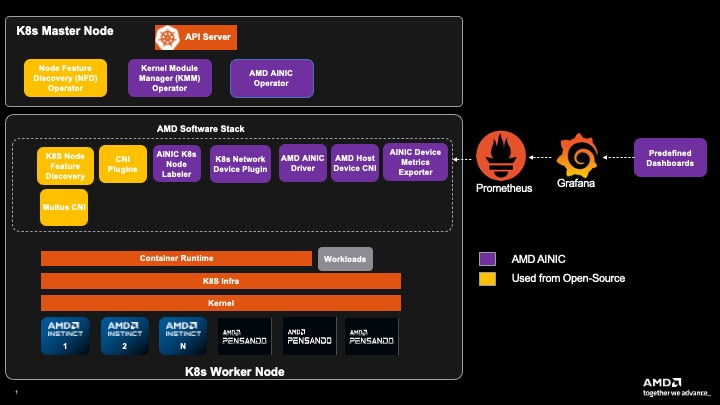

# Network Operator Overview

The AMD Network Operator consists of several key components that work together to manage AMD NICs in Kubernetes clusters. This document provides an overview of each component and its role in the system.

## Core Components

### Controller Manager

The AMD Network Operator Controller Manager is the central control component that manages the operator's custom resources. Its primary responsibilities include:

- Managing the `NetworkConfig` custom resource
- Running reconciliation loops to maintain desired state
- Coordinating upgrades, and removal
- Managing the lifecycle of dependent components (device plugin, node labeller, metrics exporter, secondary network plugins)

### Node Feature Discovery (NFD)

The [Node Feature Discovery (NFD)](https://github.com/kubernetes-sigs/node-feature-discovery) component automatically detects and labels nodes with AMD NIC hardware. Key features include:

- Detection of AMD NICs using PCI vendor and device IDs
- Automatic node labeling with `feature.node.kubernetes.io/amd-nic: "true"`
- Hardware capability discovery and reporting

### Multus

By default, Kubernetes pods connect to a single primary network. To enhance networking capabilities, Kubernetes [Network Attachment Definitions](https://github.com/k8snetworkplumbingwg/multi-net-spec) enable attaching multiple network interfaces to pods, including a primary network (through flannel/calico, etc) for core Kubernetes services and secondary networks often used for high-performance applications. The [Multus CNI plugin](https://github.com/k8snetworkplumbingwg/multus-cni) facilitates this by acting as a "meta-plugin," allowing pods to utilize multiple other CNI plugins simultaneously and thus attach multiple network interfaces to the pod. Network operator leverages Multus to attach AINIC interfaces to the workloads together with other primary interfaces.

- Attaches multiple network interfaces to a pod by invoking the CNI plugins specified in each NetworkAttachmentDefinition
- Delegates execution to other CNI plugins, acting as a coordinator rather than performing direct network configuration

### Component Interaction

The components work together in the following sequence:

1. NFD identifies worker nodes with AMD NICs
2. Controller Manager processes `NetworkConfig` custom resources
4. Device Plugin registers `amd.com/nic` or `amd.com/vnic` allocatable resources to node
5. Node Labeller adds detailed NIC information to node labels
6. Metrics Exporter provides ongoing monitoring
7. Multus and CNIs ensure the requested network device is available for workloads

### K8s Cluster with AMD Network Operator

## Plugins and Extensions

### Device Plugin

The [AMD Network Device Plugin](https://github.com/pensando/k8s-network-device-plugin) enables NIC resource allocation in Kubernetes:

- Implements the Kubernetes [Device Plugin API](https://kubernetes.io/docs/concepts/extend-kubernetes/compute-storage-net/device-plugins/)
- Registers AMD NICs as allocatable resources
- Enables NIC resource requests and limits in pod specifications

### Node Labeller

The [Node Labeller](https://github.com/pensando/k8s-network-node-labeller) provides detailed NIC information through node labels:

- Automatically detects NIC properties
- Adds detailed NIC-specific labels to nodes
- Enables fine-grained pod scheduling based on NIC capabilities

### Metrics Exporter

The [Device Metrics Exporter](https://github.com/pensando/device-metrics-exporter) provides monitoring capabilities:

- Exports NIC metrics in Prometheus format
- Monitors NIC utilization, temperature, and health
- Enables integration with monitoring systems

### Secondary Network

#### CNI Plugins

The CNI Plugins is responsible for loading all the CNIs(host-device, amd-host-device, sriov, etc.) in the worker nodes.
- NetworkAttachmentDefinitions (NADs) reference these CNI plugins to define how additional networks should be attached to a pod.
- Multus meta-plugin reads the NADs and invokes the specified CNI plugins to attach secondary network interfaces to the pod.

### Driver Management

The AMD Network Operator can manage AMD AINIC drivers on the nodes in the cluster.
It leverages the Kernel Module Management (KMM) operator to handle driver lifecycle operations including installation, upgrades, and removal across the cluster nodes.

For detailed information on driver installation, configuration, and verification, see the [Driver Management Guide](./drivers/drivers.md).
